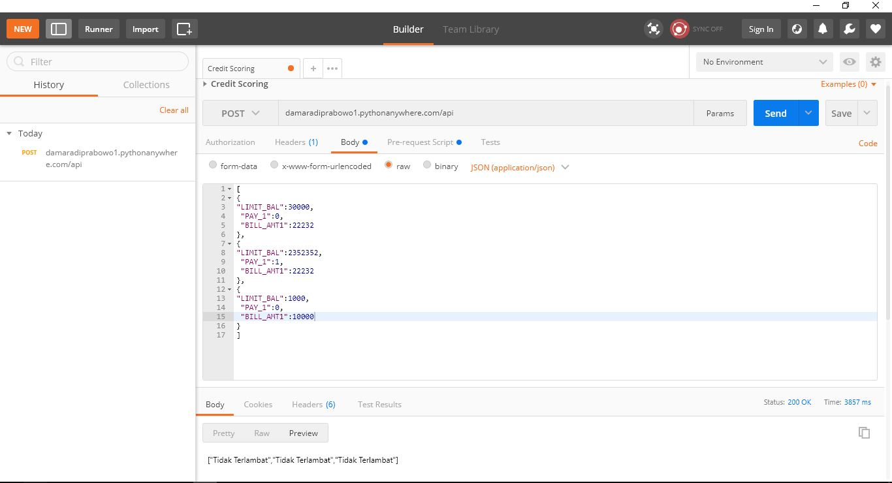

# Random Forest Model for Credit Scoring

## 1. Introduction
This repository talks about how to deploy a Random Forest Credit Scoring Model with Flask. 

## 2. Requirement
- Python 3.6
- Flask
- Pythonanywhere
- Postman

## 3. Model
### 3.1. Data
This model are using German Credit Scoring data from kaggle. It contains 14 feature and 1 label. On this model, we only use 3 feature for the training and testing.
### 3.2. Model Architecture
The used model is Random Forest with 82% of accuracy. The model are saved on a format of `model_rf.pkl`. To deploy the model, we use **Flask** as the framework, **pythonanywhere** as the server, and **Postman** for the testing.

## 4. Testing
As explained before, we use Postman for the testing. The way how to test is showed on the picture below.

End Point: http://damaradiprabowo1.pythonanywhere.com/api 
Method: .POST 
Headers: JSON 
Body: Raw
